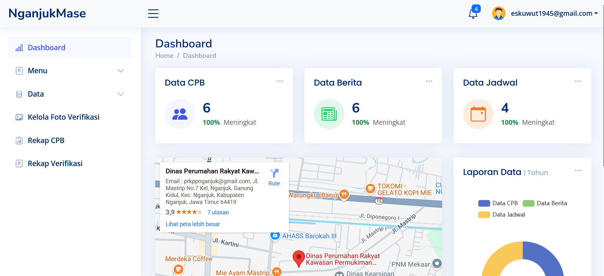
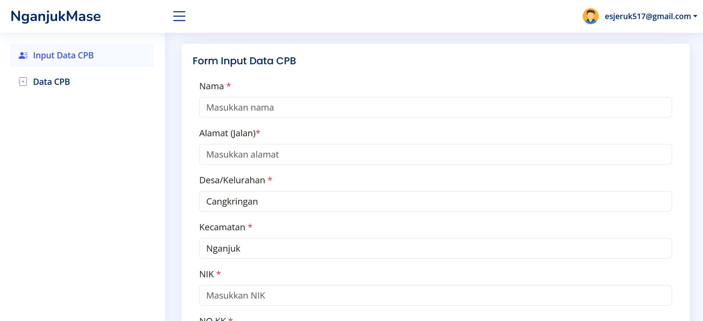

# 🏠 NganjukMase - Sistem Informasi Bantuan Rumah Tidak Layak Huni

**NganjukMase** adalah website informasi dan pengelolaan data bantuan rumah tidak layak huni (Rutilahu) di Kabupaten Nganjuk, Jawa Timur. Website ini dikembangkan sebagai media kolaborasi dengan **Dinas Perumahan Rakyat, Kawasan Permukiman dan Pertanahan Kabupaten Nganjuk**, guna memudahkan proses pendataan calon penerima bantuan, verifikasi data, serta penyampaian informasi berita dan jadwal kegiatan dinas terkait.

## 🔧 Teknologi yang Digunakan

Proyek ini dibangun menggunakan teknologi-teknologi modern dan populer untuk memastikan performa, skalabilitas, dan kemudahan pengembangan:

### 💻 Backend

-    – Framework PHP yang kuat dan mudah digunakan untuk pengembangan aplikasi web.
-    – Database relasional yang digunakan untuk menyimpan seluruh data aplikasi.

### 🖥️ Frontend

-    – Framework CSS/JS untuk desain antarmuka yang responsif dan modern.
-    – Struktur dasar halaman web.
-    – Styling antarmuka.
-    – Interaksi dinamis pada sisi klien.
-    – Library JS untuk manipulasi DOM dan AJAX.

## 📋 Fitur Utama Aplikasi

### Pengunjung Umum

-   Melihat informasi berita terbaru dari Dinas Perumahan Rakyat, Kawasan Permukiman dan Pertanahan Kabupaten Nganjuk.
-   Melihat jadwal kegiatan dinas.
-   Menampilkan jumlah data CPB.
-   Menampilkan jumlah data Verifikasi.
-   Menampilkan jumlah data Tidak Terverifikasi.
-   Menampilkan jumlah data penerima RTLH.

### Role: Admin

-   Menu profile.
-   Menu ganti password.
-   Menu semua aktivasi pengguna.
-   Mengelola berita (tambah, edit, hapus).
-   Mengelola jadwal kegiatan dinas (tambah, edit, hapus).
-   Bisa edit dan hapus data CPB yang diinput oleh petugas desa.
-   Melihat hasil verifikasi data.
-   Melihat laporan dan rekap data CPB per desa/kelurahan.
-   Melihat laporan dan rekap data Verifikasi per desa/kelurahan.

### Role: Petugas Input CPB (Kepala Desa)

-   Menu profile.
-   Menu ganti password.
-   Hanya bisa menginput/menambahkan data calon penerima bantuan (CPB) dari wilayah desa masing-masing.
-   Tidak diperbolehkan melihat data dari desa lain.
-   Hanya bisa mengedit data untuk desanya sendiri.

## 📥 Cara Menjalankan Proyek (untuk Developer)

### Prasyarat

Pastikan Anda sudah menginstal:

-    **PHP >= 8.1** – Bahasa server-side yang digunakan oleh Laravel.
-    **Composer** – Dependency manager untuk PHP.
-    **MySQL Server** – Database server untuk menyimpan data aplikasi.
-    **Git** – Untuk kontrol versi dan cloning repository.

## 📬 Kontak

Jika Anda memiliki pertanyaan atau ingin bekerja sama lebih lanjut, silakan hubungi kami melalui email resmi Dinas Perumahan Rakyat, Kawasan Permukiman dan Pertanahan Kabupaten Nganjuk.

📩 **Hajuenter**  
Email: [bahrulahmad1945@gmail.com](mailto:bahrulahmad1945@gmail.com)

## 🌐 Website: https://nganjukmase.pbltifnganjuk.com/

## 👨‍💻 Developer: BuildUp / TIF NGK B2
